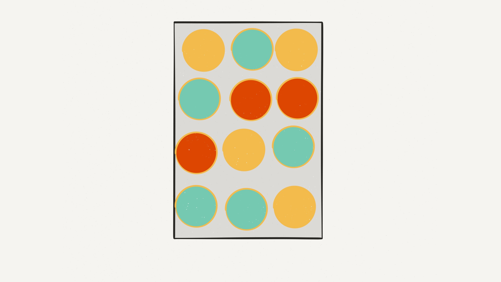
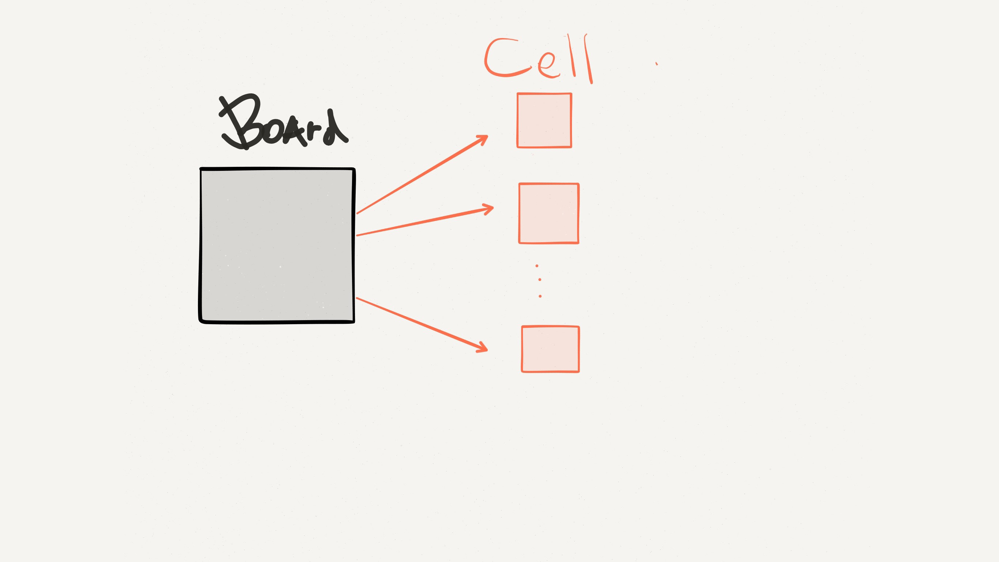
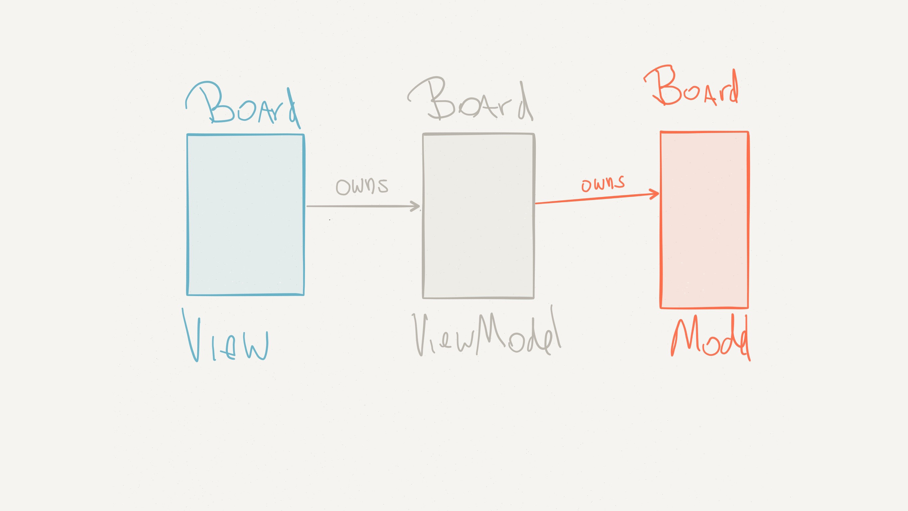
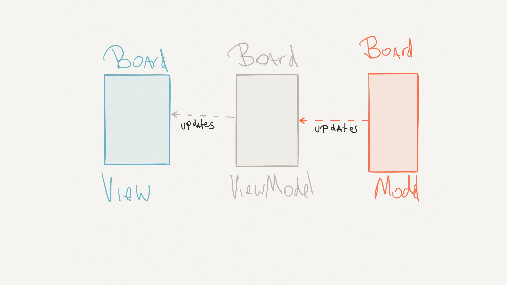
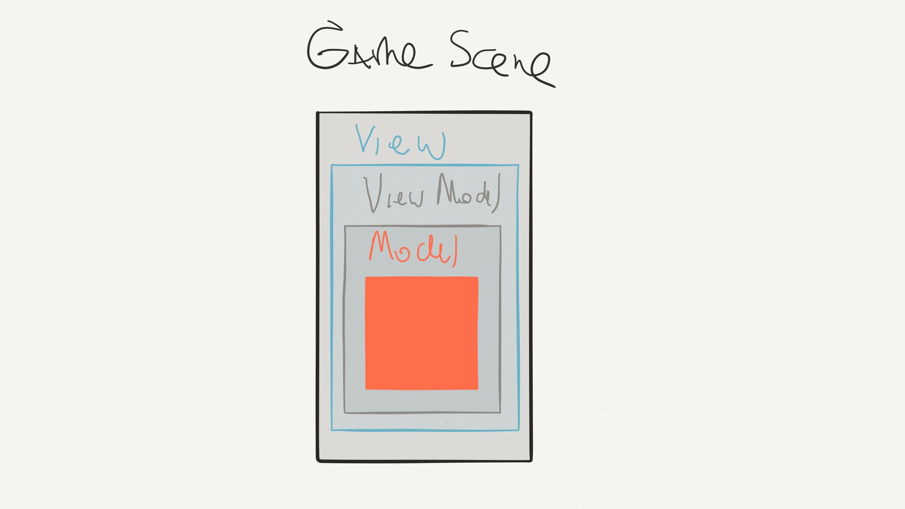

# [fit] Swift Values

^ En esta charla hablaré sobre las diferencias entre usar Value Types y Reference Types. Además propondré una forma de trabajar en Swift para ojalá, a quienes no han comenzado a desarrollar en Swift aún, emocionarlos con este excitante nuevo lenguaje.

---
# [fit] Francisco Díaz
## @fco_diaz

 

^ Soy desarrollador iOS hace más de 4 años.
^ Desarrollando en Swift desde principios de este año.
^ Parte del equipo iOS en Axiom Zen.

---
## Objective-C -> Swift

NSArray / NSMutableArray
*-> Array*

NSDictionary / NSMutableDictionary
*-> Dictionary*

NSString / NSMutableString
*-> String*

^ Cuando comencé a desarrollar en Swift una de las cosas que más me llamó la atención fue que estructuras de datos básicas, como Array, Dictionary y String ya no eran pasadas por referencia.
^ Esto en un inicio crea bugs, porque uno asume cosas falsas. Intentaré explicar las diferencias y por qué creo que este es un cambio positivo.

---
- Differences between Value / Reference Types
- Immutability in Swift
- Using Value Types

^ Partiré señalando las diferencias entre trabajar con Value Types y Reference Types.
^ Luego hablaré de los beneficios de desarrollar pensando en la inmutabilidad
^ Finalmente plantearé una estrategia para sacar provecho del uso de Value Types en nuestra aplicaciones Swift.

---
# Value Type

---
## Struct

```swift
struct Point {
    var x: Int, y: Int
}
```

^ El ejemplo clásico de un value type son los structs.
^ Digamos que tenemos un struct con variables x,y.

---
### Copying creates an *independent instance* with its own unique copy of its data

```swift
var a = Point(x: 1, y: 2)
var b = a // a: {1, 2}; b: {1, 2}
b.x = 3 // a: {1, 2}; b: {3, 2}
```

^ Cuando asigno "a" a "b", en realidad Swift está copiando los valores del struct, no mantiene la misma referencia.
^ Se puede compartir libremente.
^ Sin efectos colaterales.

---
# Reference Type

---
## Class

```swift
class Person {
    var name: String

    init(name: String) {
        self.name = name
    }
}
```

---
### Copying a reference, on the other hand, implicitly creates a *shared instance*
```swift
let pedro = Person(name: "Pedro")
var clon = pedro // pedro: {"Pedro"}; clon: {"Pedro"}
clon.name = "Pablo" // pedro: {"Pablo"}; clon: {"Pablo"}
```

^ Al asignar pedro a clon se mantiene la misma referencia en memoria.
^ Si comparto clon, estoy también compartiendo a pedro implicitamente.
^ Es más dificil razonar sobre esto.
^ Pedro como Clon pueden tener multiples dueños.
^ Crea complejidad

---
# Value Types are *Immutable*

^ Una de las razones principales de usar value types en vez de reference types es debido a su inmutablidad.
^ Lo que hace que sea más sencillo razonar sobre nuestro código.
^ Un valor siempre tendrá el mismo contenido.
^ Como ya dijimos, no genera efectos colaterales

---
What about variables? And *mutating* functions? Eh? Eh? :angry:

```swift
struct Point {
    var x: Int, y: Int

    init(x: Int, y: Int) {
        self.x = x
        self.y = y
    }

    mutating func movePointBy(x: Int, y: Int) {
        self.x += x
        self.y += y
    }
}

var a = Point(x: 1, y: 2)
a.movePointBy(3, y: 3) // a: {4, 5}
a.x = 20 // a: {20, 5}
```

^ ¿Y qué hay de las variables dentro de un Value type? ¿Y las mutating functions?

---
```swift
let a = Point(x: 1, y: 2)
a.movePointBy(3, y: 3) // Compilation error
a.x = 20 // Compilation error

// Immutable value of type 'Point' only has mutating members named 'movePointBy'
```

^ En realidad, no mutan la struct.
^ Internamente reasignan un nuevo valor al struct que ya teníamos
^ Es por esto que es necesario utilizar var en vez de let, porque no cambiará solo el valor interno que se está modificando, sino toda la struct.

---
# Using Value Types

^ Entonces, ¿cómo podemos aprovechar la utilización de valores en nuestra app?

---
# The Value layer game
### by Andy Matuschak

^ Andy Matuschak propueso crear un juego
^ Tenemos dos capas: La capa de objetos y la capa de valores

---
#### Object layer
# *Value layer*

^ Intentemos hacer que la capa de valores sea lo más grande posible, minimizando a su vez la capa de objetos.

---
## Prefer structs over classes

---
## Constants by default

```swift
struct Point {
    let x: Int, y: Int
}
```

^ Intentar mantener nuestras estructuras constantes

---
## Use mutability carefully, where it makes sense

```swift
struct Meetup {
    let speakers: [String]
}

struct Meetup {
    var speakers: [String]
    mutating func addAwesomeSpeaker(speaker: String)
}

addAwesomeSpeaker("Francisco") ~== Meetup(speaker: speakers.append("Francisco"))
```

^ Pero no hay que ser fundamentalista, cuando tenga sentido, usa mutabilidad.
^ No es malo usar mutabilidad localmente, cuando no causa efectos hacia afuera.
^ Lo que tenga más sentido para tu caso de uso, en el fondo, es lo mismo.
^ Recordar que son valores, al agregar un speaker estás creando un nuevo valor y asignándolo. No tendrá la misma referencia.

---
## Every Value type should be *Equatable*

^ Lo importante no es la identidad, sino el valor que contiene. No importa como se calculó ese valor o como se inició, solo importa el valor que contienen.

---
# Values are inherently equatable

```swift
let a = "Hola "
let b = "Mundo"
a == b // false

"Hola Mundo" == a + b // true

1 == 2 - 1 // true
```
^ Los valores son inherentemente comparables.
^ Si tenemos un string, esperamos que se comporte de esta manera, independiente donde esté alojado en memoria.

---
## How?
```swift
struct Point: Equatable {
    let x: Int, y: Int
}

func ==(lhs: Point, rhs: Point) -> Bool {
    return lhs.x == rhs.x && lhs.y == rhs.y
}
```

^ Simplemente necesitamos adherir al protocolo Equatable en Swift.
^ Equatable nos pide que implementemos una sola función la que tiene dos valores como entrada, y un booleano como salida.
^ Un punto es igual a otro solo si su valor x y su valor y es igual al del otro punto.

---
# [fit] When to use Classes?
- ` NetworkController1 == NetworkController2 ` ???
- ` UIKit `

^ Si no podemos definir la igualdad, probablemente es porque debemos usar clases en vez de structs.
^ Objects behave and respond

---
## Example

---


^ En AxiomZen hemos estado creando un nuevo juego.
^ Es bastante simple, es una tabla de juegos con varias "celdas"

---


^ Modelar esto es sencillo, un Board puede tener muchas Celdas

---
## MVVM

**Board Model:** Contains data representing a board

**Board VM:** Communicates between Model and View
    - Converts model data to be displayed
    - Takes user input and acts on model

**Board View:** Displays a board to the user

**Game Scene:** Puts it all together.

^ Para modelar esta app utilicé Model - View - ViewModel
^ El modelo contiene los datos que representan una tabla
^ El ViewModel hace la comunicación entre el modelo y la vista
^ La vista muestra la tabla
^ Y el Game Scene es quien contiene la vista y une todo.

---


---
> Choose immutability and see where it takes you.
-- Rich Hickey

^ Siguiendo el consejo de Andy Matuschak, como el de Rich Hickey, intentemos maximizar nuestra capa de valores

---
```swift
struct Board {
    let cells: [Cell]
}

struct Cell {
    let value: Int
}
```

^ Parece bastante obvio que el modelo puede ser un valor.

---
```swift
struct BoardViewModel {
    let board: Board

    func cellViewModelAtIndex(index: Int) -> CellViewModel
}


struct CellViewModel {
    let cell: Cell
    let index: Int

    func attributes() -> (color: UIColor, texture: SKTexture, ...)
}
```

^ Pero también el ViewModel puede ser un valor.
^ Nada nos obliga a que sea una clase. Puede ser además inmutable y simplemente entregar la información que se necesite.

---
```swift
class BoardView: SKSpriteNode {
    var cellViews: [CellView] = []

    init(size: CGSize)

    func configure(boardViewModel: BoardViewModel)
}

class CellView: SKSpriteNode {

    init(size: CGSize, cellViewModel: CellViewModel)

    func configure(cellViewModel: CellViewModel)

    func scaleBy(scale: CGFloat)

    func animateTouch()

    ...
}
```

^ La vista no puede ser un valor. Tendremos que utilizarla constantemente y se verá modificada.
^ Es pesada y recrearla cada vez que algo cambie es costoso.
^ No luchar contra el sistema.
^ Tenemos que interactuar con SpriteKit / UIKit que está basado en referencias.

---
## Every time something changes, create a *new BoardViewModel* and pass it to the *BoardView*

```swift
func configure(boardViewModel: BoardViewModel)
```

^ Cada vez que algo cambia, por ejemplo, cuando se toca una celda, esto creará una nueva tabla.
^ Lo que creará un nuevo BoardViewModel, que será pasado al BoardView para ser configurado.

---


---
## Only update what *changed*

^ A pesar de que son referencias, se configuran con un ViewModel (valor).
^ Cada vez que ViewModel se modifica, se le pasa una estructura INMUTABLE a la vista para que se configure.

---
# But how do I know what changed?

^ La vista sabe qué ha cambiado (ya que tiene el valor anterior) y solo actualiza

---

# They're Values
...and you can *compare* values easily

```swift
func configure(cellViewModel: CellViewModel) {
    if oldCellViewModel != cellViewModel {
        // update
    }
}
```

---


---
- Differences between Value / Reference Types
- Immutability in Swift
- Using Value Types

---
# Resources:
[Swift Blog: Value and Reference Types](https://developer.apple.com/swift/blog/?id=10)
[Should I use a Swift struct or a class?](http://faq.sealedabstract.com/structs_or_classes/?)
[WWDC 2015: Session 408](https://developer.apple.com/videos/wwdc/2015/?id=408)
[WWDC 2015: Session 414](https://developer.apple.com/videos/wwdc/2015/?id=414)
[The Value of Values by Rich Hickey](http://www.infoq.com/presentations/Value-Values)
[Enemy of the State by Justin Spahr-Summers](https://www.youtube.com/watch?v=7AqXBuJOJkY)
[Functioning as a Functionalist by Andy Matuschak](https://www.youtube.com/watch?v=rJosPrqBqrA)
[Immutable Data and React by Lee Byron](https://www.youtube.com/watch?v=I7IdS-PbEgI)

---
# [fit] That's a wrap!
Slides available at:
[https://github.com/fdiaz/swift-values-talk](https://github.com/fdiaz/sisifo-talk)
